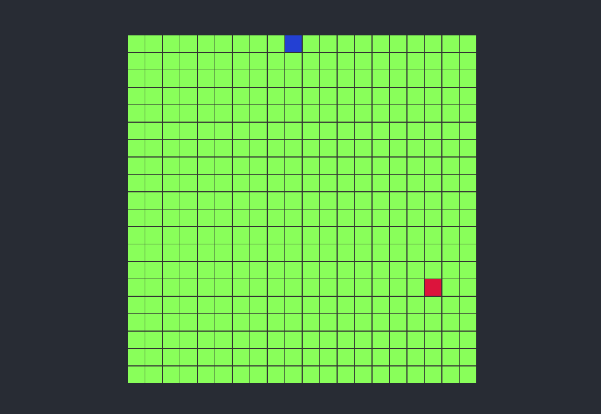

# 🐍 Snake-Game
Este é um jogo da cobrinha desenvolvido pelo professor André Noel em uma aula ao vivo no canal da Rocketseat. O objetivo do jogo é controlar a cobrinha para coletar alimentos e crescer o máximo possível sem colidir com as paredes ou com o próprio corpo.

## 🌟Funcionalidades
- Controle da cobrinha usando as setas do teclado

## 🚀 Tecnologias Utilizadas
- HTML5
- CSS3
- JavaScript

## Como Jogar
Para jogar, abra o arquivo `index.html` em seu navegador. Você verá o frame do jogo onde a cobrinha se moverá.

  

